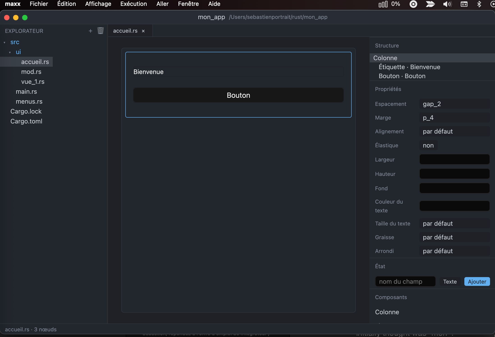

# maxx

A visual workshop that builds [GPUI](https://gpui.rs) views and writes them out
as real Rust source.

You create or open a project, drop components in, set their properties, wire up
an action — and what comes out is an ordinary `gpui` + `gpui-component` project
that compiles and runs without maxx, and opens in Zed like any other Rust
project.



## The principle

**The `.rs` file is the truth.** maxx has no screen format of its own; it writes
into `src/ui/<view>.rs` and reads it back with `syn`.

A view is modelled as *one base expression plus an ordered list of method
calls* — exactly the shape GPUI code already has:

```rust
// maxx:begin
v_flex()
    .gap_2()
    .p_4()
    .child(Label::new("Name"))
    .child(Input::new(&self.field))
    .child(Button::new("submit").label("Submit").on_click(cx.listener(Self::on_submit)))
// maxx:end
```

That is what makes the round trip safe:

- a method maxx does not know is carried as data and written back verbatim;
- an expression that is not a builder chain — an `if`, a `match`, a component of
  your own — becomes an opaque node, shown but never rewritten;
- `syn` never sees the whole file, because it throws comments away: the managed
  region is found by scanning the text between `// maxx:begin` and
  `// maxx:end`, and saving touches only that byte range. The rest of the file —
  imports, `impl`, methods, comments, formatting — is untouched by construction,
  not by care.

The corollary: what you write by hand in Zed is read back by maxx, and what maxx
writes is Rust you could have written yourself.

## Usage

```sh
cargo run              # welcome screen
cargo run -- <path>    # open a project directly
```

`File > New project…` creates a complete project, `File > New view…` adds a view
and registers it in `src/ui/mod.rs`.

On the canvas: click to select, drag to move, double-click a button to give it
an action. Columns resize by their handle, and their width is remembered. `⌘S`
writes the file, `⌘Z` / `⌘⇧Z` undo and redo, `⌘D` duplicates the selected node,
`⌘⌥C` and `⌘⌥V` copy and paste it, `⌘⇧⌫` deletes it, and `⌘B` hides the project
panel.

What `⌘⌥C` puts on the clipboard is Rust, not a format of maxx's own: a subtree
copied here pastes into Zed, and an expression written there pastes back.

In the project panel, a view opens on the canvas and every other file — a
`Cargo.toml`, a `README.md`, a `main.rs` with no managed region — opens in the
code reader: syntax highlighting, line numbers, selection and copy, and no
writing. Right-click gives *View the code* for any file; editing stays in your
editor, one `⌘⌥Z` away.

`⌘E` turns the view being designed over. What it shows is not the file on disk
but the Rust `⌘S` would write, rendered from the tree as it stands — so the
canvas and the code can never disagree. Press it again to come back. One tab
either way: it is the same document, seen from two sides.

`⌘K` opens the command palette. It has no list of its own — it *is* the menu
bar, flattened, with the path that leads to each command and the keystroke it
answers to, both read back rather than written a second time. Type words in any
order: `settings add` finds `File ▸ Add to project ▸ The settings`.

## Language

The interface is English by default and French is bundled; `⌘,` has the choice,
under Appearance. "System" follows what the system reports and falls back to
English, and anything not translated shows in English rather than as a key.

The change takes effect at once — labels are translation keys resolved when
they are drawn, and the native menu bar is the only piece handed to the system
again.

A language is one file: `locales/app.yml`, one entry per key with a line per
language. `tests/locales.rs` reads the sources and refuses a key the code cites
without a translation, or a translation nobody uses. A missing key would not
fail the build; it would put `message.node_copied` on screen where a sentence
belongs, which is exactly the kind of defect that reaches the user first.

What is *not* translated, on purpose: everything maxx writes. Module names,
field names, the comments in the generated modules, `settings.json` and its
documentation — source code and the files that sit beside it stay in English
whatever the interface speaks. A project written in French on Monday and opened
in English on Tuesday would otherwise be two different projects.

## The demo

```sh
cd demo && cargo run
```

An ordinary project, committed in [`demo/`](demo/), written in the shape maxx
produces and reads back: the catalogue's components in one view, a second window
opened from the menu bar, a menu bar editable in maxx. It doubles as the tests'
reference — read every view back, rewrite without moving a line, read the menu
bar back.

## Requirements

Rust 1.88 or newer — maxx uses `&& let` chains, which the 2024 edition alone
does not enable.

**macOS**: Xcode. The `gpui` dependency turns on the `runtime_shaders` feature,
which compiles the Metal shaders at startup rather than at build time: Xcode 26
ships the Metal toolchain as a separate downloadable component, and without that
feature the build fails on a missing `metal` tool. Generated projects carry the
same feature, for the same reason.

**Linux**: the development packages gpui expects — Vulkan, Wayland, X11,
fontconfig, ALSA. The exact list is in
[`.github/workflows/ci.yml`](.github/workflows/ci.yml).

**Windows**: the MSVC toolchain.

CI checks macOS on every push, and all three systems on pull requests, on
demand and once a week. A `v*` tag opens the release gate: the whole matrix, a
release build, and binaries for the three systems attached to the release.

What CI does not prove: that maxx is usable. No test opens a window — they cover
the model, the parser, the templates and the settings. maxx is developed on
macOS, and that is the only system where its interface has been tried by hand.

## View state

A text property is a literal by default. The inspector's `abc` button makes it
read a field of the view instead:

```rust
Label::new("Title")                 →   Label::new(self.title.clone())
```

The dropdown works the same way: it is bound to a field of the view, which maxx
declares and initialises with two example entries. What the list contains is
ordinary code, and it is yours.

Fields are declared in the "State" section, which inserts them into the struct
and into `new`. A `usize` or an `f32` is rendered with `.to_string()`, a
`SharedString` with `.clone()`.

A bound property is no longer editable as free text: overwriting it with a
literal would quietly change what the code means.

What is left to write by hand, deliberately: the bodies of the methods. The `→`
button beside the Action property opens your editor on the method's line. And do
not forget `cx.notify()` — without it the field changes and the screen does not
move.

## What you add to a project

`File > Add to project` copies code into the project and declares it. Code, not
a dependency on maxx: what is copied is yours.

- **The menu bar** — `src/menus.rs`, editable afterwards in maxx.
- **The system module** — `src/system.rs`.
- **The settings** — `src/settings.rs`, which brings the system module with it.
- **The palette** — `src/theme.rs`, light and dark from the start.

What was copied is recorded in `maxx.toml`, to be committed with the project:
which module, in which version, and the fingerprint it had on the way out. When
a newer version exists, maxx says so when the project opens, and
`File > Add to project > Update modules` lays it down. A file you have edited is
never replaced — it is reported, and that is all.

### The settings

The same discipline maxx applies to its own: JSON with comments, a documented
defaults file written on first launch, and **only the key that changes is
rewritten** — your comments and your layout survive. A missing, partial or
damaged file never stops the application from starting.

Add your fields to `Settings`, one line in `documented_defaults`, and that is it.
Two crates are declared along the way, `serde` and `serde_json_lenient`; both
are already compiled in the tree by gpui, so the build does not grow.

### The palette

Roles rather than colours, and two values for each: `BACKGROUND` says where it
goes and survives a change of palette, `0x1e2127` says what it looks like in one
of the two modes and does not.

Two modes and not one, because the choice is not the developer's to make:
someone reading in a dark room and someone in the sun want opposite things, and
the system already knows which. `theme::follow_system` reads that answer at
startup, `theme::toggle` moves it, and both go through `gpui_component`'s own
theme so the components follow in the same gesture rather than keeping a second
mode that could disagree.

maxx itself works the same way, and `View > Light or dark` switches both what it
draws and what the canvas shows the components in — the preview is only worth
having if it can be seen in the mode the reader will use.

## The system module

`File > Add to project > The system module` copies `src/system.rs` into the
project and declares it in `main.rs`. Plain `std`: no maxx, no gpui, copyable
elsewhere as is.

It holds only what genuinely differs from one system to the next **and** is not
already in gpui: where an application's files go (settings, data, cache), an
atomic write, and moving a file to the trash — `~/.Trash` on macOS, the
freedesktop specification with its `.trashinfo` on Linux, an application-owned
trash on Windows.

The clipboard, opening a URL, revealing a file in the file manager, the file
pickers: gpui has them already (`cx.write_to_clipboard`, `cx.open_url`,
`cx.reveal_path`, `cx.open_with_system`, `cx.prompt_for_paths`). Wrapping them
would add noise, so the module leaves them alone.

## Menu bar

A GPUI application has no menu bar at all until it calls `set_menus` — not even
a Quit. The template therefore ships one, in `src/menus.rs`, with the gestures
macOS expects: About, Hide, Quit, an Edit menu wired to the system actions, and
Minimize.

The "Shortcut" field writes into `key_bindings` and refuses a keystroke gpui
could not read — an unreadable keystroke makes the application refuse to start.

Entries are reordered with `⌘⌃↑` and `⌘⌃↓`, or dragged — the keys stay inside
one list, the drag is what carries an entry from one menu to another. A menu can
hold a submenu — one level, which is already one more than most applications use
well.

That file has a managed region of its own: open it from the explorer and maxx
shows a menu editor. Adding an entry with an unknown action declares that action
in `actions!` and writes it an empty handler, the way double-clicking a button
does for a view. An entry maxx does not recognise — a hand-written call, a
nested submenu — is kept exactly as it is.

## Files changed outside maxx

maxx keeps a copy of the file in memory, so writing without looking at the disk
would overwrite whatever was typed in Zed meanwhile. When the window regains
focus, and again before every save, maxx compares:

* the disk changed and the tree was not touched here — automatic reload, the way
  an editor does for an unmodified buffer;
* both sides changed — the write is refused, the status bar says so, and
  `File > Reload view` (⌘⇧R) or `File > Overwrite file` settles it.

## Opening a view maxx did not write

`File > Adopt this view` puts the markers around the expression a hand-written
`fn render` returns. Nothing else is touched, and the statements before the
final expression are left as they are. If the body does not end in an
expression, adoption fails and says so: maxx would not know where to cut.

## Building generated projects

`gpui` and `gpui-component` amount to some 750 crates. A project with its own
`target/` recompiles all of them, which costs several minutes for every new
project.

Every generated project therefore gets a `.cargo/config.toml` pointing at a
shared cache, `~/Library/Caches/maxx/target`: the first project pays the price,
the next ones are nearly instant. Since the file holds an absolute path it is
machine-local, and it sits in the project's `.gitignore` — losing it costs one
recompilation. A `cargo run` typed in a terminal reads the same file, so the
terminal and maxx share the cache.

When a project is created, `cargo build` starts in the background to pay that
cost while you are drawing. `Run > Prewarm dependencies` runs it again on
demand.

## Layout

| File | Role |
|---|---|
| `src/model.rs` | the tree: base, calls, arguments, opaque nodes |
| `src/codegen.rs` | model → Rust text |
| `src/parser.rs` | Rust text → model, markers and textual splicing |
| `src/registry.rs` | the component catalogue — the only place to extend |
| `src/view.rs` | one open view: loading, saving, insertions |
| `src/scaffold.rs` | project and view templates |
| `src/designer.rs` | canvas, structure, inspector, palette |
| `src/workspace.rs` | the window, the state, the commands |
| `src/about.rs` | the About window |

How it all fits together, and why: [`ARCHITECTURE.md`](ARCHITECTURE.md).
What is known and deferred is in [`BACKLOG.md`](BACKLOG.md).

Those two, and the interface strings, are still in French; the code and its
comments are in English.

## Settings

maxx detects the editors and terminals installed and lets you choose which one
receives your files — `⌘⌥Z` and the inspector's `→` button follow that choice,
down to the line number, which every editor spells differently. Terminal editors
(Helix, Neovim, Vim) are started inside the chosen terminal.

Settings ▸ Tools ▸ **Format on save** runs `rustfmt` over the file after every
write, honouring the project's `rustfmt.toml`. On by default, and not out of
zeal: a Rust editor formats on save — that is the default in Zed as in
rust-analyzer — and what maxx writes is not what rustfmt would write. Without
this setting, the editor and maxx reformat the managed region back and forth,
one spurious diff per turn. maxx therefore applies itself what the editor would
apply anyway. Turn it off if your project does not use rustfmt: it formats the
whole file.

`⌘,` opens the settings screen, as a tab rather than a modal: `⌘W` closes it and
gives the current view back.

Two files in `~/Library/Application Support/maxx/` — `$XDG_CONFIG_HOME` or
`~/.config` elsewhere, `%APPDATA%` on Windows.

`settings.json` is yours. JSON with comments, like Zed's, written with its
defaults and a line of explanation per key the first time. **maxx rewrites only
the key it changes**: your comments and your layout stay. A schema is dropped
beside it, so your editor completes.

`state.json` is maxx's: recent projects, window position. Nobody edits it, so it
is rewritten whole.

A missing, partial or damaged file never stops maxx from starting — every value
has a default, and an unreadable file is reported and then left alone, so that
whatever you were in the middle of writing is not overwritten.

## Licence

maxx is MIT licensed — see [`LICENSE`](LICENSE).

GPUI and gpui-component are Apache-2.0, which asks for nothing more than
shipping their licence and keeping their copyright notices. One transitive
crate, `option-ext`, is MPL-2.0. The detail, and what distributing a binary
requires, is in [`THIRD-PARTY.md`](THIRD-PARTY.md).

Generated projects inherit no licence: maxx writes ordinary Rust, and it is
yours.
